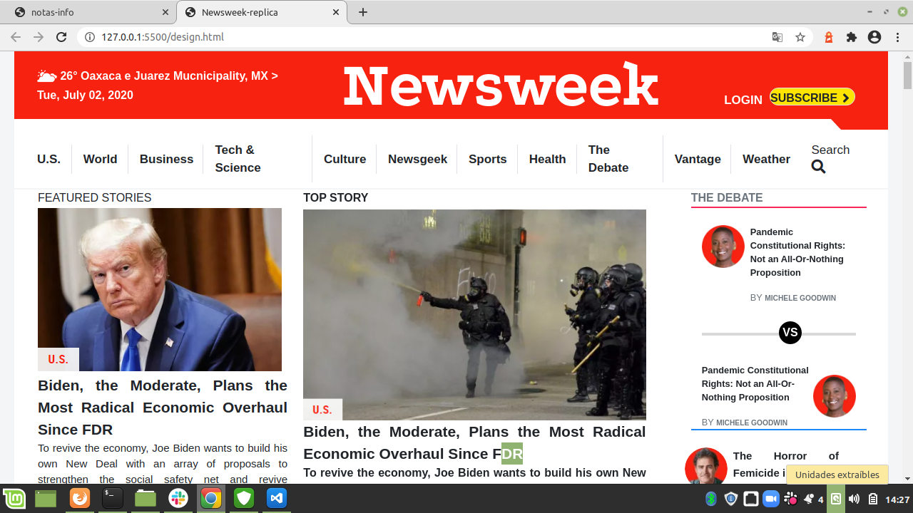

# using-Bootstrap
This project consists of building a heatmap of the [this]( Newsweek.com /)

I created this project in the Workarea branch.

## Built With

HTML5
CSS
bootstrap

## [Live Link](https://rawcdn.githack.com/atenaiis/using-Bootstrap/24b52765886e9df97145bb565575e08f85dfd3cc/design.html)

## Authors

👤 **Author1**

- Github: @atenaiis
- Twitter: @spranomarian

## Show your support

Give a ⭐️ if you like this project!

## Acknowledgments

Thanks to Team 123 Ocicats and Team 121 Ragdolls.
=======